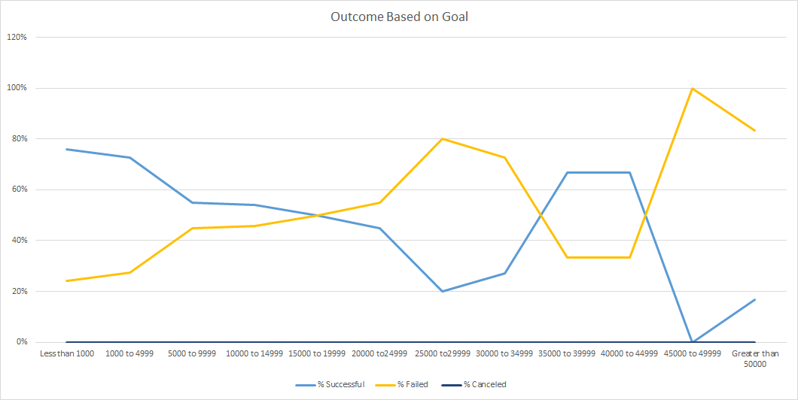

# An Analysis of Kickstarter Campaigns
Module 1: Performing analysis on Kickstarter data to uncover trends
## Overview of Project: 
We noticed that *Fever* came close to its fundraising goal, so we wanted to analyze the results in comparison to other campaigns within the same category. The purpose is to see if there was a trend of within the Theatre category based on funding goals and campaign results. The analysis report would help provide next steps of what actions to take or possibly changes to make for the next campaigns.

## Analysis and Challenges: Explaining the steps taken to achieve the results: 
### Steps for Challenge 1: Theater Outcomes by Launch Date 
* First, we had to remove any "live" campaigns from the data since those are still on going and results have not been finalized. Next, I created a pivot table to see over all trends based on outcomes. 
* In order to create the pivot table, I had to drag the following in the proper fields:
    * Parent Category and Years in filters
    * Outcomes in the column and value fields
    * Date Created Conversion  in the row field, removing months and quarters so only years show.
    
When looking at the pivot table, it was difficult to analyze or draw any insights from the chart.  You will see in the [pivot table](https://drive.google.com/drive/folders/1eSgV00O8FJ03HGqcbXv0cmouGCaOzCbP?usp=sharing) it just shows total count of campaigns by outcomes, nothing really jumps out when looking at this chart.  However, when creating a line chart below, you can see how visually the trends base on outcomes.  By visualizing the data, you can also see any outliers or issues with the data. 

*Overall, there wasn't any big challenges when creating the pivot table.  However, when trying to draw any insights just from the pivot table was a challenge.  I wasn't able to create a story or provide any feedback without looking taking the next step of creating the table. 

### Steps for Challenge 2: Outcome Based on Goal
*For this challenge, I had to first find the total number based on outcomes (successful,failed or canceled).  By using the *countifs* formula, I was able to get the total number for each goal segment.  This was a challenge for me since I had to ensure the goal brackets were accurate.  This was difficult since sometimes, I forgot a digit so I had to review the goals a few times to make sure I had the right numbers. 
-After calculating the total number of outcomes by goals, it was easily to calculated percentage breakdown for each outcome.  Then I created a line chart below to start my analysis. 

Markup:-----
##Results to Questions: 
    -Question 1: Two conculsions from Theater Outcomes by Launch date: 
        A. 
        B. 
    -Question 2: Conculsion for Outcomes based on goals? 

    -Question 3: Limitations of this dataset

    -Question 4: Other possible tables/graphs that we can create
    
