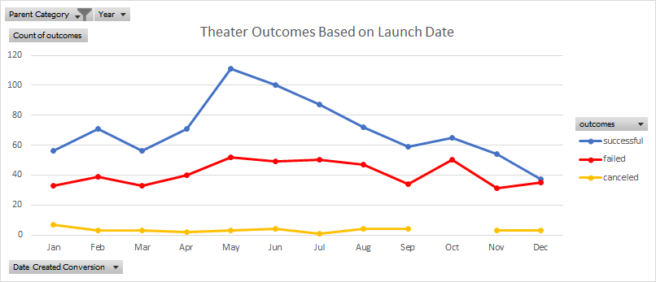
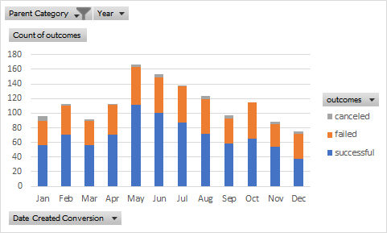

# An Analysis of Kickstarter Campaigns
Module 1: Performing analysis on Kickstarter data to uncover trends
## Overview of Project: 
We noticed that *Fever* came close to its fundraising goal, so we wanted to analyze the results in comparison to other campaigns within the same category. The purpose is to see if there was a trend of within the Theatre category based on funding goals and campaign results. The analysis report would help provide next steps of what actions to take or possibly changes to make for the next campaigns.

## Analysis and Challenges: Explaining the steps taken to achieve the results: 
### Steps for Challenge 1: Theater Outcomes by Launch Date 
* First, we had to remove any "live" campaigns from the data since those are still on going and results have not been finalized. Next, I created a pivot table to see over all trends based on outcomes. 
* In order to create the pivot table, I had to drag the following in the proper fields:
    * Parent Category and Years in filters
    * Outcomes in the column and value fields
    * Date Created Conversion  in the row field, removing months and quarters so only years show.
    
When looking at the pivot table, it was difficult to analyze or draw any insights from the chart.  You will see in the [pivot table](https://drive.google.com/drive/folders/1eSgV00O8FJ03HGqcbXv0cmouGCaOzCbP?usp=sharing) it just shows total count of campaigns by outcomes, nothing really jumps out when looking at this chart.  However, when creating a line chart below, you can see visually the trends base on outcomes.  By visualizing the data, you can also see any outliers or issues with the data. 

Overall, there wasn't any big challenges when creating the pivot table.  However, when trying to draw any insights just from the pivot table, it was a challenge.  As you can see there was a decline starting in May but you're not able to see why without pulling in another data set. I had to include goals to see if there an increase/decrease of goal settings here. 

### Steps for Challenge 2: Outcome Based on Goal
For this challenge, I had to first find the total number of each outcome(successful,failed or canceled) based on goals.  By using the *countifs* formula, I was able to get the total number for each goal segment.  This was a challenge for me since I had to ensure the goal brackets were accurate in the formula.  This was a long process since I had to double check the formula to make sure it was pulling the correct goal segment. 
After calculating the total number of outcomes by goals, it was easy to calculated percentage breakdown. Then I created a line chart,below, to start my analysis. 

## Results to Questions: 
#### Question 1: Two conculsions from Theater Outcomes by Launch date: 
        - The most successful Theatre campaign was in May. 
        - There was a decline after May, which shows possibly the goal was set too high.  After pulling the goals into the pivot table, you can see that the goal was growing as the number of successful campaigns were declining. 
#### Question 2: Conculsion for Outcomes based on goals? 
The most successful campaigns were when the goals were set at below $1,000.  Anything higher than $1K, the campaigns started to decline.  As the goals got hight the percentage of failed campaigns also got higher. 
#### Question 3: Limitations of this dataset
The data set didn't provide a little more information as to why the campaigns failed.  It would've been nice to have more time to clean up or organize the information a little more.  Plus the pivot tables only represented a small portion of the data so it doesn't give a full story of what is going on with the overall campaigns that are running in all categories.
#### Question 4: Other possible tables/graphs that we can create
* Insert Combo chart, showing outcomes and goals in the line chart 
* Stacked bar chart for theater outcomes

    
